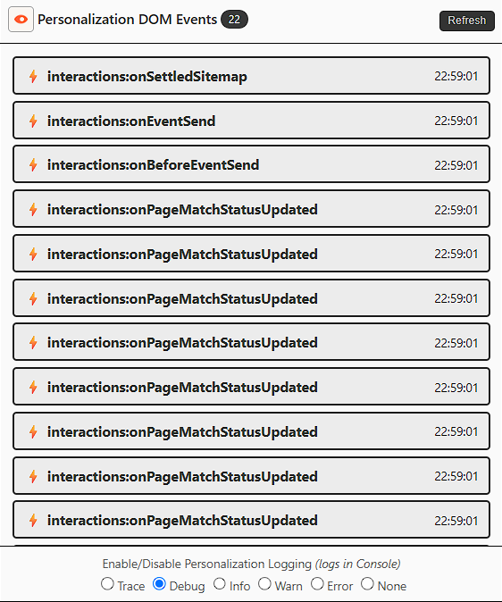
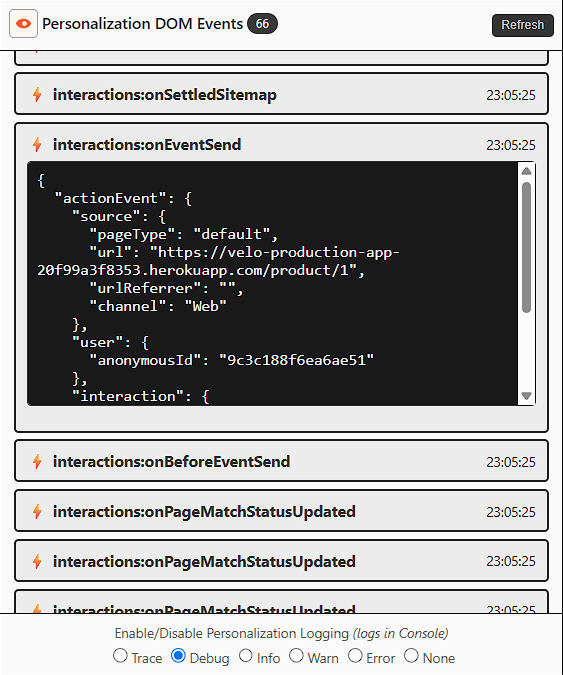
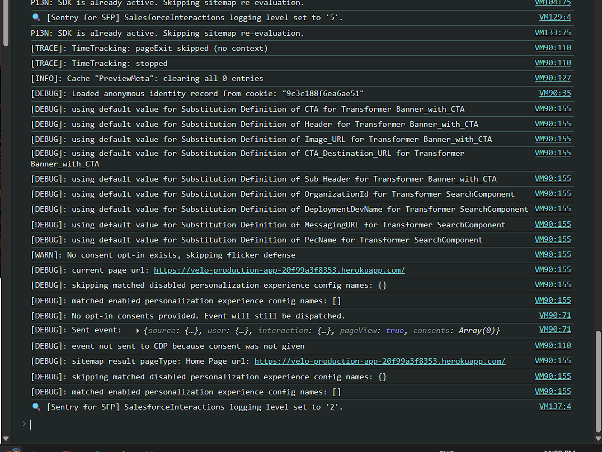

# Sentry for Salesforce Personalization

> A lightweight browser extension for real-time debugging, logging control, and DOM event inspection for the Salesforce Interactions SDK (Salesforce Personalization).

---

## Overview

**Sentry for Salesforce Personalization** is the ultimate developer tool for debugging, monitoring, and validating Salesforce Personalization (Salesforce Interactions SDK) web integrations in real time.

Stop digging through crowded browser developer tools or manually invoking console commands. **Sentry for SFP** exposes internal SDK event hooks and log controls directly in a clean, intuitive popup UI, streamlining the workflow for developers, architects, and QA specialists.

---

## Key Features

* **Live DOM Event Feed:** Capture real-time custom DOM events dispatched by the Salesforce Interactions SDK, including `interactions:onBeforeEventSend`, `interactions:onEventSend`, `interactions:onSettledSitemap`, and `interactions:onPageMatchStatusUpdated` (reference: [Salesforce Interactions DOM Events](https://developer.salesforce.com/docs/data/salesforce-interactions-sdk/guide/c360a-api-integration.md)).
* **Event Payload Inspector:** Expand individual events to inspect detailed JSON payloads, including `actionEvent`, user ID/anonymous mapping, page type source context, and interaction details.
* **On-the-Fly Console Logging Control:** Dynamically set the `SalesforceInteractions` log level directly from the UI without reloading. Switch seamlessly between **Trace**, **Debug**, **Info**, **Warn**, **Error**, or **None** (reference: [Salesforce API Debugging](https://developer.salesforce.com/docs/data/salesforce-interactions-sdk/guide/c360a-api-debugging.md)).
* **Consent & Sitemap Diagnostics:** Easily spot sitemap matching issues, flicker defense behavior, consent opt-in status, and CDP event transmission blockers directly in your browser console.

---

## Ideal For

* **Salesforce Technical Architects & Developers** implementing or debugging the Web SDK and Sitemap.
* **QA & Implementation Specialists** validating event triggers, user attributes, and interaction payloads.
* **Marketers & Admins** troubleshooting why experiences or personalization campaigns aren't firing on specific page matches.

---

## Screenshots

|                    Event Stream & Selector                    |                      Payload Inspection                       |                     Console Debug Output                      |
| :-----------------------------------------------------------: | :-----------------------------------------------------------: | :-----------------------------------------------------------: |
|  |  |  |

---

## Installation

This extension is distributed exclusively through official browser extension stores. 

* **Google Chrome:** [Download from the Chrome Web Store](#) *(Link to be added)*
* **Mozilla Firefox:** [Download from Firefox Add-ons](#) *(Link to be added)*

---

## How to Use

1. Install the extension from your browser's official store.
2. Navigate to any website running the **Salesforce Interactions SDK**.
3. Click the **Sentry for Salesforce Personalization** extension icon in your browser toolbar.
4. Use the radio options at the bottom of the popup to adjust SDK logging in the Browser DevTools Console.
5. Click **Refresh** or interact with the page to stream live SDK events and inspect event details.

---

## Support and Inquiries

If you encounter any bugs, have feature requests, or need general support, please reach out to us via our [Contact Us page](#).

---

## Privacy Disclaimer
This extension does not collect, store or transfer any data locally or to any external platform.